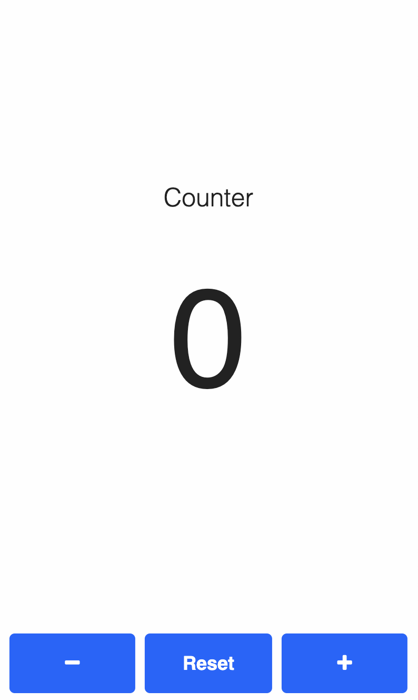
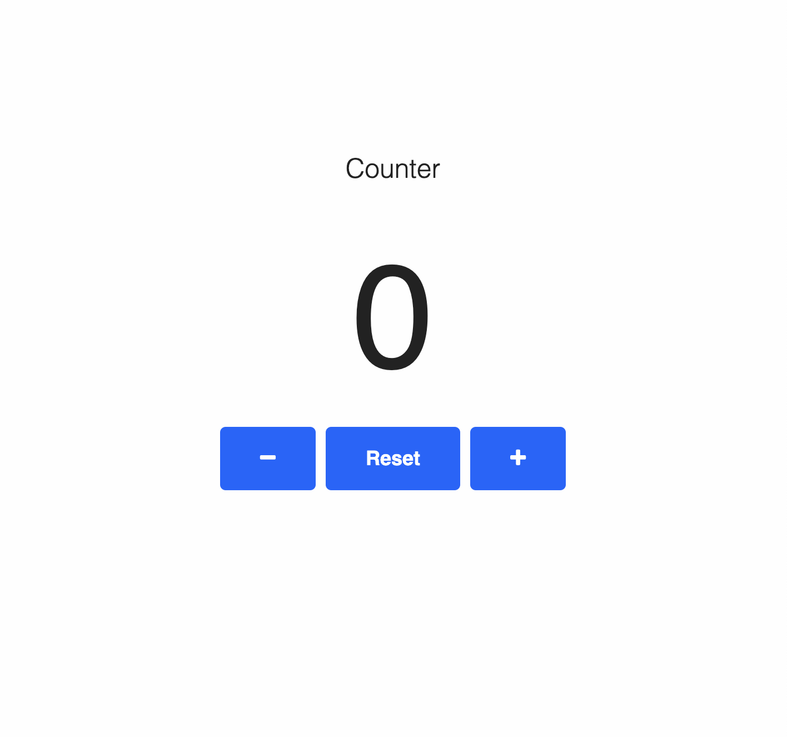

# Counter

This is a beginner's practice project to apply my knowlege of DOM manipulation using JS. A simple counter.

## Need to count something?

Use this counter on any device to keep count of whatever you need to in your daily life. You can increase, decrease or reset your count. 

## Responsive design

1. On mobile screens:

2. On larger screens:

## Getting started

* Counter is set to zero by default. 
* Because the idea behind the application is to count actual things, the counter does not decrease beyond zero. 

## Technologies

* HTML
* CSS
* JavaScript
